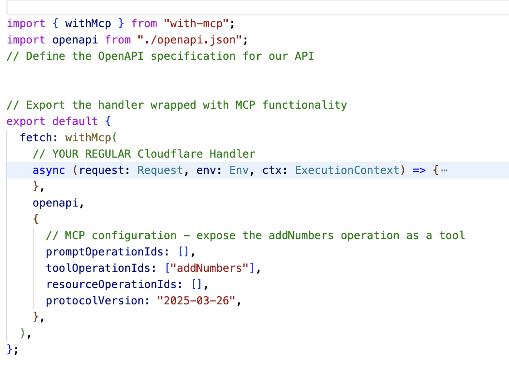

A simple middleware that turns your serverless server handler + OpenAPI spec + config into a exposed MCP endpoint following the new [stateless MCP principles](https://github.com/janwilmake/stateless-mcp)

See [example](example.ts) for how to use this.

Earlier work: https://github.com/janwilmake/openapi-to-mcp
